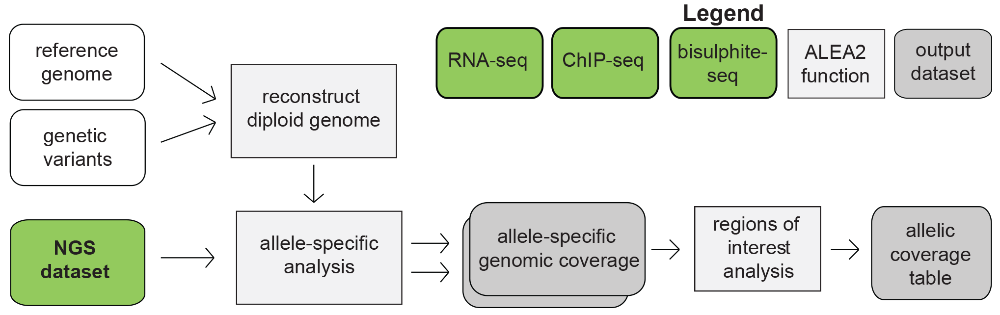

# ALEA2: a computational pipeline for integrated allele-specific profiling of DNA methylation, histone modifications and transcription

Building on our previous work on the ALEA software package, a computational toolbox for allele-specific epigenomics analysis incorporating allelic variation data, we detail here ALEA’s successor - ALEA2. This package dramatically increases the functionality and usability of ALEA, incorporating allelic variation with existing resources, allowing for the identification of significant associations of epigenetic modifications and specific allelic variants in human and mouse cells. Similar to ALEA, ALEA2 provides a customizable pipeline for allele-specific analysis of next-generation sequencing data which takes raw sequencing data for ChIP-seq, RNA-seq and DNA Methylation analysis, producing a UCSC track hub. ALEA2 takes advantage of the available genomic resources for human (The 1000 Genomes Project Consortium) and mouse (The Mouse Genome Project) to reconstruct diploid in silico genomes for human samples or hybrid mouse samples. Then, for each accompanying ChIP-seq, RNA-seq or DNA Methylation dataset, ALEA2 generates two wig files from short reads aligned differentially to each haplotype. This pipeline has been validated using human and hybrid mouse ChIPseq, RNAseq and DNA Methylation data (See [Test Data](#test-data)). 

## Please refer to the ALEA2 user guide (PDF) for installation and run instructions
  
* [Docker installation](https://github.com/hyounesy/ALEA/raw/master/docker)  
* [distribution package](https://github.com/hyounesy/ALEA/raw/master/dist/alea.2.0.tar.gz)
* [documentation (PDF)](https://github.com/hyounesy/ALEA/raw/master/doc/ALEA2-userguide.pdf)
* test data: ftp://ftp.bcgsc.ca/supplementary/ALEA/files/test-data/

## Credits
Hamid Younesy, Torsten Möller, Alireza Heravi-Moussavi, Jeffrey B. Cheng, Joseph F. Costello, Matthew C. Lorincz, Mohammad M. Karimi and Steven J. M. Jones, "ALEA: a toolbox for allele-specific epigenomics analysis." Bioinformatics 30.8 (2014): 1172-1174. [[link to paper](http://bioinformatics.oxfordjournals.org/content/30/8/1172.long)]
