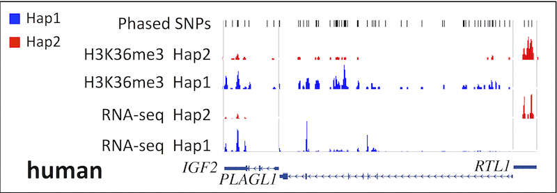
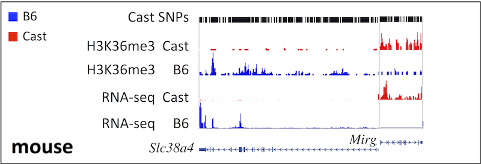

# ALEA: a toolbox for Allele-specific Epigenomics Analysis


ALEA  is a computational toolbox for allele-specific (AS) epigenomics analysis, which incorporates allelic variation data within existing resources, allowing for the identification of significant associations between epigenetic modifications and specific allelic variants in human and mouse cells. ALEA provides a customizable pipeline of command line tools for AS analysis of next-generation
sequencing data (ChIP-seq, RNA-seq, etc.) that takes the raw sequencing data and produces separate allelic tracks ready to be viewed on genome browsers. ALEA takes advantage of the available genomic resources for human (The 1000 Genomes Project Consortium) and mouse (The Mouse Genome Project) to reconstruct diploid in silico genomes for human samples or hybrid mouse samples under study. Then, for each accompanying ChIP-seq or RNA-seq dataset, ALEA generates two wig files from short reads aligned differentially to each haplotype. This pipeline has been validated using human and hybrid mouse ChIP-seq and RNA-seq data (See [Test Data](#test-data)). 

## Table of contents
  * [Quick Reference](#quick-reference)
  * [Installation](#installation)
  * [Test Data](#test-data)
  * [Usage](#running-alea)
    * [Genotype phasing](#genotype-phasing) 
    * [Insilico genome creation](#insilico-genome-creation)
    * [Allele-specific Alignment](#allele-specific-alignment)
    * [projecting-to-reference-genome](projecting-to-reference-genome)
  * [Examples](#examples-1)
    * [Human skin fibroblast](#example-1-human-skin-fibroblast) 
    * [Mouse trophoblast](#example2-mouse-trophoblast)
  * [Using SHAPEIT2](#using-shapeit2-for-genotype-phasing)
  * [Credits](#credits)
  
## Quick Reference
### Dependencies
ALEA runs from command line and requires a UNIX based operating system. You also need to install an appropriate version of the following dependencies:

Java (1.6 +), Python (2.4 +), bwa (0.7 +) and/or bowtie (1.0.0 or 2.0.9), samtools (0.1.18 +), tabix (0.2.5 +), bgzip, bedGraphToBigWig, SHAPEIT2, VCFtools (0.1.10 +), Plink (1.07 +). 

### Pipeline
The following figure shows the allele-specific analysis pipeline in ALEA.


### Synopsis

``` bash
alea phaseVCF hapsDIR unphased.vcf outputDIR

alea createGenome reference.fasta phased.vcf.gz strain1 strain2 outputDir

alea createGenome -snps-indels-separately reference.fasta phased_snps.vcf.gz phased_indels.vcf.gz strain1 strain2 outputDir

alea alignReads -s reads.fastq  genome_concat.fasta  strain1  strain2  outputPrefix

alea alignReads -p reads_1.fastq reads_2.fastq  genome_concat.fasta  strain1  strain2  outputPrefix

alea createTracks <-s/-p> bamPrefix strain1 strain2 genome1.refmap genome2.refmap chrom.sizes outputDIR
```
##	Installation
####	Files
* [distribution package](https://github.com/hyounesy/ALEA/raw/master/alea.1.2.2.tar.gz)
* [documentation (PDF)](https://github.com/hyounesy/ALEA/raw/master/doc/ALEA-userguide.pdf)
* test data: ftp://ftp.bcgsc.ca/supplementary/ALEA/files/test-data/
* genome browser tracks:ftp://ftp.bcgsc.ca/supplementary/ALEA/files/tracks/

#### Hardware requirements
It is recommended to run ALEA on a 64-bit UNIX based machine with a minimum of 4GB available RAM and 60 GB available disk space (to process both human and mouse test-data).

#### Software dependencies

ALEA runs from command line and requires a UNIX based operating system as well as a working version of Java (version 1.6 or higher) and Python (version 2.4 or higher). Further more, the following software needs to be installed:  

* [**bwa**](http://sourceforge.net/projects/bio-bwa/files/): used to align reads to in silico genomes (pipeline figure: c)


* [**bowtie**](http://bowtie-bio.sourceforge.net/bowtie2/index.shtml) (optional): used to align reads to concatenated genome (pipeline figure: c)

  Note: ALEA uses bwa for alignment by default, but also supports bowtie. You may specify the aligner tool by editing the ```<alea>/bin/alea.config``` file.
 
* [**samtools**](http://sourceforge.net/projects/samtools/files/samtools/): used to process bam files (pipeline figure: c).


* [**bedGraphToBigWig**](http://hgdownload.cse.ucsc.edu/admin/exe/)  and [**wigToBigWig**](http://hgdownload.cse.ucsc.edu/admin/exe/): used to convert bedGraph and wig files to bigWig files (pipeline figure: d).

* [**tabix**](http://sourceforge.net/projects/samtools/files/tabix/) (0.2.5 or higher) and **bgzip** (included with tabix): used to create the phased vcf files (pipeline figure: a)

* [**SHAPEIT2**](http://www.shapeit.fr/pages/m01_basic/download.php) used to phase genotypes given to this program in Plink BED/ BIM/FAM format and generates phased haplotypes in HAPS/SAMPLE format (pipeline figure: a). The process is further described in: [Using SHAPEIT2](#using-shapeit2-for-genotype-phasing).

* [**VCFtools**](http://sourceforge.net/projects/vcftools/files/): used to convert genotypes in VCF format to Plink PED/MAP file format (pipeline figure: a). The process is further described in: [Using SHAPEIT2](#using-shapeit2-for-genotype-phasing).


* **Plink**: used to split the genotypes in PED/MAP format by chromosomes prior to phasing since SHAPEIT phases only one chromosome at a time. This software also converts the genotype from each chromosome from PED/MAP to BED/BIM/FAM format ready to be used by SHAPEIT2 (pipeline figure: a). The process is further described in: [Using SHAPEIT2](#using-shapeit2-for-genotype-phasing).
It is recommended to have all the required dependencies, however different modules use only certain external tools. For example to work with the mouse data, you won’t need the phasing module (pipeline figure: a) as phased vcf files are alredy provided. Thus SHAPEIT, vcftools, tabix and Plink won’t be necessary.


#### Download

To start, download the latest [distribution package](https://github.com/hyounesy/ALEA/raw/master/alea.1.2.2.tar.gz) and extract using: 

```bash
tar xzf alea.1.2.2.tar.gz
```

The contents will be extracted into a directory named alea which will be referred as ```<alea>``` through the rest of the document.
Once done, you may run  ```<alea>/download_human_data.sh``` and/or ```<alea>/download_mouse_data.sh``` scripts to get the  human or mouse (or both) test datasets. These scripts download all the required input data resources you need to run the allele-specific analysis explained in the [Examples](#examples-1) section. For each test data you will need 30GB of storage space for the raw input and processed output data  (i.e. 60GB for both mouse and human).
You may also (optionally) download the individual test data from the data directory (ftp://ftp.bcgsc.ca/supplementary/ALEA/files/test-data/)

#### Setting the options
Options such as the allelic alignment method (using concatenated vs. separate genome), aligner tool (BWA or Bowtie) and parameters passed to external tools can be modified in the ```<alea>/bin/alea.config```. The most important options are:

* ```AL_USE_CONCATENATED_GENOME```: Enables use of concatenated genome method (default:```=1```) or the separate genome method (```=0```)
* ```AL_USE_BWA```: Specifies using BWA for alignment (default)
* ```AL_USE_BOWTIE1```: Specifies using Bowtie1 for alignment
* ```AL_USE_BOWTIE2```: Specifies using Bowtie2 for alignment
* ```AL_DEBUG```: Sets debug mode. When enabled (=1) the tool will print all the executed commands, and won't remove temporary files.


#### Setting the paths

You can set up the paths to the required tools in either of the following ways:

*  Update ```<alea>/bin/alea.config``` file and edit the variables starting with ```AL_BIN_```  to point the locations of the tools.
e.g if bwa is installed under ```~/bin/bwa```, make the following change: 

  ``` bash
AL_BIN_BWA="~/bin/bwa"
```

Or:

*  Create a link to the location of tools inside the ```<alea>/bin directory```.
e.g. 

  ``` bash
cd <alea>/bin
ln –s PATH_TO_BWA bwa
ln –s PATH_TO_SAMTOOLS samtools
ln –s PATH_TO_SAMTOOLS samtools
ln –s PATH_TO_TABIX tabix
ln –s PATH_TO_BGZIP bgzip
ln –s PATH_TO_BEDGRAPHtoBIGWIG bedGraphToBigWig
```

## Test Data

We employed our AS pipeline on human skin fibroblast RNA-seq and H3K36me3 ChIP-seq datasets generated from the same individual. The original data is available for download under the GEO accession numbers [GSM751277](http://www.ncbi.nlm.nih.gov/geo/query/acc.cgi?acc=GSM751277) and [GSM817238](http://www.ncbi.nlm.nih.gov/geo/query/acc.cgi?acc=GSM817238). We used whole genome sequencing (WGS) data for this individual and called genotype in VCF format for this individual from WGS data and put the VCF file in the same folder as FASTQ files are. 

#### Test Data for Human
All required files can be downloaded from the data repository(ftp://ftp.bcgsc.ca/supplementary/ALEA/files/test-data/human/) or automatically using the script ```<alea>/download_human_data.sh```  (Note: requires wget). All four ALEA modules (See pipeline figure) have been applied on this dataset to reconstruct in-silico genomes, detect haplotype-specific sequencing reads, and generate separate read profiles for each haplotype for RNA-seq and H3K36me3 data. RNA-seq data may be downloaded manually using the GEO accession number provided above.

#### Test Data for Mouse
A similar approach was also applied to a recently published dataset for mouse trophoblast cells [Calabrese et al., 2012], including RNA-seq and H3K36me3 ChIP-seq data derived from crosses between CAST/EiJ (Cast) and C57BL/6J (B6) mice. The original data is available for download under the GEO accession numbers [GSM967646](http://www.ncbi.nlm.nih.gov/geo/query/acc.cgi?acc=GSM967646) and [GSM967642](http://www.ncbi.nlm.nih.gov/geo/query/acc.cgi?acc=GSM967642). Variant sequence data was obtained from the [Sanger Institute](http://www.sanger.ac.uk/science/data/mouse-genomes-project) (accessed 2/15/2016).
All required data can be downloaded from (ftp://ftp.bcgsc.ca/supplementary/ALEA/files/test-data/mouse/) or automatically using the script ```<alea>/download_mouse_data.sh``` (Note: requires wget).  RNA-seq data are not downloaded automatically by the download scripts but may be downloaded manually using the provided GEO accession numbers.

#### Tracks
The ALEA commands used to generate final haplotype-specific tracks for the human and mouse dataset are explained in more details later in [Examples](#examples-1).
The final bigWig files (.bw) of haplotype-specific H3K36me3, RNA-seq and variant tracks for human and mouse as well as the textual .track files can be downloaded from (ftp://ftp.bcgsc.ca/supplementary/ALEA/files/tracks) and used directly in UCSC genome browser to check the regions of interest. Click on the following figures to navigate to the corresponding genome browser session:

[](https://genome.ucsc.edu/cgi-bin/hgTracks?db=hg19&lastVirtModeType=default&lastVirtModeExtraState=&virtModeType=default&virtMode=0&nonVirtPosition=&position=chr8%3A57073468-57123859&hgsid=481885967_e5Rpa8AoNwbVKgMUQRd4d4x8ujAN)
[](https://genome.ucsc.edu/cgi-bin/hgTracks?db=mm9&lastVirtModeType=default&lastVirtModeExtraState=&virtModeType=default&virtMode=0&nonVirtPosition=&position=chr7%3A6614038-6677007&hgsid=481884209_C1mDzztaYYu6lohVjIVeLxxZlMFw)

As we expected, H3K36me3 enriches the gene body of active genes and correlates with expression level of selected imprinted genes in a mono-allelic manner in both human and mouse.


##	Running ALEA

ALEA consists of the following four modules for which the processes, the input and output files and their formats are shown in Figure 1.

### Genotype phasing
For human samples, genotypes are typically called from whole genome-sequencing (WGS) short reads accompanying the epigenomic dataset under AS study. SHAPEIT2 is then employed to phase genotypes in using the publicly available reference panel of haplotypes, provided by the 1000 Genomes project  ([Using SHAPEIT2](#using-shapeit2-for-genotype-phasing) explains the details of running SHAPEIT2 using reference panel of haplotypes). We then use the output of SHAPEIT2, i.e. phased haplotypes (.haps), together with the original unphased variant file (VCF) to create a phased variant file with two haplotypes containing homozygous and phased heterozygous SNPs and Indels (pipeline figure a).

For mouse datasets, ALEA accepts epigenomic marks from F1 hybrid offspring whose parents are among the 17 inbred strains available from the Mouse Genome Project. Therefore, the phased variant file is already available and we do not need the phasing step.  The phased SNPs and Indels files are downloaded and placed under ```<alea>/test-data/mouse``` using the ```<alea>download_mouse_data.sh``` script.

The bellow commands are only required on human samples.

##### Usage
```alea phaseVCF hapsDIR unphased.vcf outputPrefix```

##### Options

* ```hapsDIR```:        		path to the directory containing the .haps files
* ```unphased.vcf```:   		path to the vcf file containing unphased SNPs and Indels
* ```outputPrefix```:		output file prefix including the path but not the extension

##### Output
Creates the file ```outputPrefix.vcf.gz```

### Insilico genome creation
The output of the phasing module, the phased variant file, together with the reference genome is
fed into the second module (pipeline figure b) in which haplotype regions are reconstructed from the individual haplotypes. Two insilico genomes are created to be used for the optimal identification of chromosomal or allele specific effects. For mouse, the two insilico genomes represent the parental haplotypes, however for human the two genomes will essentially be a mosaic of the parental haplotypes due to the unlikeliness of true long-range phasing. In addition to the two insilico genomes, this module also concatenates these parental genomes for each chromosome and makes an artificial genome which is twice the size of the parental genomes. This new genome is used later for finding haplotype-specific epigenomic reads.

One can run the bellow command for both human and mouse. The name of strains can be found from the ```phased.vcf.gz``` file. For human, it is always "hap1" and "hap2", which are the names that SHAPEIT2 uses for phased haplotypes. For mouse, these are the names of the parental inbred mice crossing to create F1 hybrid mouse under study (e.g. *CASTEiJ* (Cast) and *C57BL6J* (B6) mice). ALEA accepts 17 mouse strain names from the following:
*C57BL6J , 129S1 , AJ , AKR , BALBcJ  , C3HHeJ , C57BL6NJ , CASTEiJ , CBAJ , DBA2J , FVB_NJ , LPJ , NODShiLtJ , NZO , PWKPhJ , Spretus , WSBEiJ*

##### Usage
 * When all SNPs and Indels are in a single vcf file:

  ```
  alea createGenome reference.fasta \
         phased.vcf.gz \
         strain1 strain2 outputDir \
  ```

* When the SNPs and Indels are in two separate vcf files:

  ```
  alea createGenome -snps-indels-separately reference.fasta \
         phased_snps.vcf.gz phased_indels.vcf.gz \
         strain1 strain2 outputDir
  ```

##### Options

* ```reference.fasta``` the reference genome fasta file
* ```phased.vcf.gz``` the phased variants vcf file (including SNPs and Indels)
* ```strain1``` name of strain1 exactly as specified in the vcf file (e.g. hap1)
* ```strain2``` name of strain2 exactly as specified in the vcf file (e.g. hap2)
* ```outputDir``` location of the output directory
* ```-snps-indels-separately``` use if SNPs and Indels are in two separate vcf files
* ```phased-snps.vcf.gz``` the phased SNPs (should be specified first)
* ```phased-indels.vcf.gz``` the phased Indels  (should be specified second)

##### Output
Creates two parental in-silico genomes strain1.fasta and strain2.fasta as well as alignment indices.
 A concatenated genome strain1_strain2.fasta will be created if ```AL_USE_CONCATENATED_GENOME=1``` is set in ```alea.config```.

*Note*:  It is possible to have SNPs and Indels in two separate vcf files. In that case use -snps-indels-separately option, and make sure you specify SNPs before Indels.

### Allele-specific Alignment

We use BWA or Bowtie to align ChIP-seq or RNA-seq short reads in FASTQ format (BWA also supports fastq.gz and bam as input) to the insilico genomes constructed by the previous module and detect the allelic reads that are uniquely aligned to each genome (pipeline figure c). These reads map to the regions containing heterozygous SNPs and can be used to determine the allelic ratios for those regions. Consequently, all reads aligned to multiple locations of either haplotypes or aligned to both haplotypes are filtered out. Thus, the module captures the haplotype-specific reads aligned only to one of the haplotypes. Samtools is employed to convert and sort the generated SAM files to BAM format. 

The bellow command can be applied on both human and mouse data. To find eligible names for human and mouse strains, refer to [Insilico genome creation](#insilico-genome-creation).

##### Usage

* using concatenated genome method (```AL_USE_CONCATENATED_GENOME=1```):

  ```alea alignReads <-s/-p> <input_reads_1 [input_reads_2]> <genome_concat> <strain1 strain2> <outputPrefix>```

* using separate insilico genomes method (```AL_USE_CONCATENATED_GENOME=0```):

  ```alea alignReads <-s/-p> <input_reads_1 [input_reads_2]> <genome1  genome2> <strain1 strain2> <outputPrefix>```

##### Options
* ```-s```              to align single-end reads (requires one input file)
* ```-p```              to align paired-end reads (requires two input files)
         
* ```input_reads_1```   the 1st input reads file in fastq.
                    (fastq.gz or bam is supported when using BWA)
                    
* ```input_reads_2```   (paired end) the 2nd input reads file in fastq.
                    (fastq.gz or bam is supported when using BWA)
                    
* ```genome_concat```   (when ```AL_USE_CONCATENATED_GENOME=1```)
                    path to the indexed reference for concatenated insilico genome.
  for BWA, specifiy path to the fasta.
                    for Bowtie, specify index filename prefix (minus trailing .X.ebwt or .X.bt2)
                    
* ```genome1```         (when AL_USE_CONCATENATED_GENOME=0)
                    path to the indexed reference for 1st insilico genome (of strain1).
                    for BWA, specifiy the fasta file.
                    for Bowtie, specify index filename prefix (minus trailing .X.ebwt or .X.bt2)
                    
* ```genome2```         (when ```AL_USE_CONCATENATED_GENOME=0```)
                    path to the indexed reference for 2nd insilico genome (of strain2).
                    for BWA, specifiy the fasta file.
                    for Bowtie, specify basename of index files.
                    
* ```strain1```        name of strain1
                    (e.g. ```hap1``` or ```CASTEiJ```)
                    
* ```strain2```         name of strain2
                    (e.g. ```hap2``` or ```C57BL6J```)
                    
* ```outputPrefix```    prefix for output files, including the full path, without an extension
                    (e.g. ```./TSC_H3K36me3``` )

##### Output

* ```outputPrefix_strain1_starin2.sam``` (when ```AL_USE_CONCATENATED_GENOME=1```) all reads aligned to the concatenated insilico genome                                       
* ```outputPrefix_strain1_all.sam``` (when ```AL_USE_CONCATENATED_GENOME=0```)
 all reads aligned to the first insilico genome
                                       
* ```outputPrefix_strain2_all.sam``` (when AL_USE_CONCATENATED_GENOME=0)
 all reads aligned to the second insilico genome
                                       
* ```outputPrefix_strain1.bam``` allelic reads for strain1 genome (sorted bam)
    
* ```outputPrefix_strain2.bam``` allelic reads for strain2 genome (sorted bam)

##### Examples

(when: ```AL_USE_CONCATENATED_GENOME=1, AL_USE_BWA=1```):
    
```
alea alignReads -s H3K36me3.fastq CASTEiJ_C57BL6J.fasta CASTEiJ C57BL6J ./H3K36me3

alea alignReads -p H3K36me3_1.fastq H3K36me3_2.fastq CASTEiJ_C57BL6J.fasta CASTEiJ C57BL6J ./H3K36me3
```

(when: ```AL_USE_CONCATENATED_GENOME=0, AL_USE_BWA=1```):

```
alea alignReads -s H3K36me3.fastq CASTEiJ.fasta C57BL6J.fasta CASTEiJ C57BL6J ./H3K36me3
```
    
(when: ```AL_USE_CONCATENATED_GENOME=0, AL_USE_BOWTIE1=1```)
```
alea alignReads -s H3K36me3.fastq bowtie1-index/CASTEiJ bowtie1-index/C57BL6J CASTEiJ C57BL6J ./H3K36me3
```

### Projecting to reference genome
The forth module (pipeline figure d) generates two haplotype-specific track files from mapped reads and projects them back to the reference genome. Due to the existence of Indels in the construction
of parental in-silico genomes the coordinates of the tracks are skewed once compared to the reference genome. However, most visualization tools work based on alignment to reference genomes. Using the bwa index file created with the in-silico genomes, ALEA maps the tracks back to the reference genome.

The bellow command can be applied on both human and mouse data. To find eligible names for human and mouse strains, see section [insilico genome creation](#insilico-genome-creation) above.

##### Usage
```alea createTracks <options> bamPrefix strain1 strain2 genome1.refmap genome2.refmap chrom.sizes outputDIR```

##### Options
* ```-s``` to create tracks for the single-end aligned reads
* ```-p``` to create tracks for the paired-end aligned reads
* ```bamPrefix``` prefix used for the output of alignReads command
* ```strain1``` name of strain1 (e.g. hap1)
* ```strain2``` name of strain2 (e.g. hap2)
* ```genome1.refmap``` path to the refmap file created for insilico genome 1
* ```genome2.refmap``` path to the refmap file created for insilico genome 2
* ```chrom.sizes``` path to the chromosome size file (required for creating .bw)
* ```outputDIR``` output directory (where to create track files)
         
##### Output
* ```outputDIR/outputPrefix_strain1.bedGraph``` and ```outputDIR/outputPrefix_strain1.bw``` (read profiles for strain1 projected to reference genome)
* ```outputDIR/outputPrefix_strain2.bedGraph``` and ```outputDIR/outputPrefix_strain2.bw``` (read profiles for strain2 projected to reference genome)
* ```outputDIR/outputPrefix_strain1.wig.gz``` and ```outputDIR/outputPrefix_strain2.wig.gz``` unprojected read profiles for strain1 and strain2

## Examples

### Example 1: Human skin fibroblast
Before testing ALEA on the human data you need to download the human skin fibroblast test data (reference, SNPs & Indels, ChIP-seq data, etc) by running the ```<alea>/download_human_data``` script.

You need atleast 10GB of disk space for the input data and another 15GB to run the pipeline.
Please also make sure to set the path to required external software as explained in the section [Setting the paths](#setting-the-paths).
You can verify that you have the necessary files by running the following and comparing the output:

``` bash
ls –go test-data/human

-rw-r--r--  1 3153508730 Aug 19 18:16 GRCh37-lite.fa
-rw-r--r--  1       2746 Aug 19 18:16 GRCh37-lite.fa.fai
-rw-r--r--  1 3763798789 Aug 20 10:37 H3K36me3_fib01_A08393_1.fastq.gz
-rw-r--r--  1       1983 Aug 19 18:03 hg19.chrom.sizes
-rw-r--r--  1  153521412 Aug 19 18:04 skin01_a20921.phased.vcf.gz
-rw-r--r--  1    1579411 Aug 19 18:04 skin01_a20921.phased.vcf.gz.tbi
-rw-r--r--  1  885350370 Aug 19 18:06 skin01_a20921.vcf
drwxr-xr-x  2       4096 Aug 20 12:59 skin01_haplotypes
-rw-r--r--  1   15952145 Aug 20 13:05 skin01_haplotypes.tar.gz
```

##### Genotype phasing
``` bash
bin/alea phaseVCF \
         test-data/human/skin01_haplotypes \
         test-data/human/skin01_a20921.vcf \
         test-data/human/skin01_phased
```
##### Insilico genome creation
``` bash
bin/alea createGenome \
         test-data/human/GRCh37-lite.fa \
         test-data/human/skin01_a20921.phased.vcf.gz \
         hap1 hap2 test-data/human
```

##### Allele-specific alignment
``` bash
bin/alea alignReads -s \
         test-data/human/H3K36me3_fib01_A08393_1.fastq.gz \
         test-data/human/hap1_hap2.fasta \
         hap1 hap2 test-data/human/H3K36me3
```

##### Projecting to reference genome
``` bash
bin/alea createTracks -s \
         test-data/human/H3K36me3 hap1 hap2 \
         test-data/human/hap1.fasta.refmap \
         test-data/human/hap2.fasta.refmap \
         test-data/human/hg19.chrom.sizes \
         test-data/human
```

### Example2: Mouse trophoblast

Before testing ALEA on the mouse data you need to download the mouse test data (reference, SNPs & Indels, ChIP-seq data, etc) by running the <alea>/download_mouse_data script
You need atleast 15GB of disk space for the input data and another 15GB to run the pipeline.
Please also make sure to set the path to required external software as explained in the section [Setting the paths](#setting-the-paths).
You may run the following to verify that  all necessary files are downloaded.

``` bash
> ls –go test-data/mouse

-rw-r--r-- 1        441 Aug 20 15:35 C57BL6J.fasta.refmap
-rw-r--r-- 1  562442894 Aug 20 11:57 H3K36me3.fastq.gz
-rw-r--r-- 1  688377229 Aug 26 17:29 mgp.v2.indels.chrname.vcf.gz
-rw-r--r-- 1    1769414 Aug 26 17:29 mgp.v2.indels.chrname.vcf.gz.tbi
-rw-r--r-- 1 5580872284 Aug 26 17:31 mgp.v2.snps.chrname.vcf.gz
-rw-r--r-- 1    2279428 Aug 26 17:31 mgp.v2.snps.chrname.vcf.gz.tbi
-rw-r--r-- 1 2688098092 Aug 26 17:34 mm9_build37_mouse.fasta
-rw-r--r-- 1        689 Aug 26 17:34 mm9_build37_mouse.fasta.fai
-rw-r--r-- 1        331 Aug 19 15:05 mm9.fullchrom.sizes
-rw-r--r-- 1         16 Aug 26 17:35 README.txt
```

##### Insilico genome creation
The following will create the insilico genomes CASTEiJ.fasta as well as concatenated CASTEiJ _C57BL6J.fasta if using concatenated genome method ```(AL_USE_CONCATENATED_GENOME=1)```.
Note that since C57BL6J is the reference genome itself (thus no entry in the vcf file), no new insilico genome will be created for it.

``` bash
bin/alea createGenome -snps-indels-separately \
         test-data/mouse/mm9_build37_mouse.fasta \
         test-data/mouse/mgp.v2.snps.chrname.vcf.gz \
         test-data/mouse/mgp.v2.indels.chrname.vcf.gz \
         CASTEiJ C57BL6J test-data/mouse
```

##### Allele-specific alignment
default (using concatenated genome method ```AL_USE_CONCATENATED_GENOME=1```):

``` bash
bin/alea alignReads -s \
         test-data/mouse/H3K36me3.fastq.gz \
         test-data/mouse/CASTEiJ_C57BL6J.fasta \
         CASTEiJ C57BL6J test-data/mouse/H3K36me3
```

when using separate genome method (```AL_USE_CONCATENATED_GENOME=0```):

```bash
bin/alea alignReads -s \
         test-data/mouse/H3K36me3.fastq.gz \
         test-data/mouse/CASTEiJ.fasta \
         test-data/mouse/C57BL6J.fasta \
         CASTEiJ C57BL6J test-data/mouse/H3K36me3
```

##### Projecting to reference genome
```bash
bin/alea createTracks -s \
         test-data/mouse/H3K36me3 CASTEiJ C57BL6J \
         test-data/mouse/CASTEiJ.fasta.refmap \
         test-data/mouse/C57BL6J.fasta.refmap \
         test-data/mouse/mm9.fullchrom.sizes \
         test-data/mouse
```

## Using SHAPEIT2 for genotype phasing

We employed SHAPEIT2 for genotype phasing. Since we generated the genotype of our human data in VCF format, we needed a few pre-processing steps to convert our VCF file to the most appropriate format used by SHAPEIT2, i.e. Plink BED/ BIM/FAM format. This can be done by a series of commands running VCFtools and Plink before we run SHAPEIT2: 

**Converting VCF format to Plink PED/MAP format**:

```vcftools --vcf  skin01_a20921.vcf --force-index-write --plink --out skin01_a20921```


**Splitting the genotypes in PED/MAP format by chromosomes and converting them to BED/BIM/FAM format**:

``` bash
for chr in $(seq 1 22) ; do 
  plink --file skin01_a20921 --chr $chr --recode --out chr$chr --noweb ; 
done
plink --file skin01_a20921 --chr X --recode --out chrX --noweb

for chr in $(seq 1 22) ; do 
  plink --file chr$chr --make-bed --out chr$chr --noweb; 
done 
plink --file chrX --make-bed --out chrX --noweb
```

To run SHAPEIT2 on reference panel of haplotypes, provided by the 1000 Genomes project, one should first download the 1,000 Genomes phase1 haplotype set in the correct format. This will be automatically done once you run “<alea>/download_human_data.sh” script. The following two commands run SHAPAIT2 on split genotype for each chromosome (in BED/BIM/FAM format ) using reference panel of haplotypes:

**Alignment of the SNPs between the genotype and the reference panel**:

``` bash
/bin/SHAPEIT/shapeit.v2.r644.linux.x86_64 \
  -check -B ../skin01_a20921_break/chr1 \
  -M /1000_Genomes_phase1_haplotype/ALL_1000G_phase1integrated_v3_impute/genetic_map_chr1_combined_b37.txt \
  -R /1000_Genomes_phase1_haplotype/ALL_1000G_phase1integrated_v3_impute/ALL_1000G_phase1integrated_v3_chr1_impute.hap.gz \
     /1000_Genomes_phase1_haplotype/ALL_1000G_phase1integrated_v3_impute/ALL_1000G_phase1integrated_v3_chr1_impute.legend.gz \
     /1000_Genomes_phase1_haplotype/ALL_1000G_phase1integrated_v3_impute/ALL_1000G_phase1integrated_v3.sample \
  --output-log chr1.alignments
```

**Phasing the genotype using the reference panel of haplotypes**

```bash
/bin/SHAPEIT/shapeit.v2.r644.linux.x86_64  \
  -B ../skin01_a20921_break/chr1 \
  -M /1000_Genomes_phase1_haplotype/ALL_1000G_phase1integrated_v3_impute/genetic_map_chr1_combined_b37.txt \
  -R /1000_Genomes_phase1_haplotype/ALL_1000G_phase1integrated_v3_impute/ALL_1000G_phase1integrated_v3_chr1_impute.hap.gz \
    /1000_Genomes_phase1_haplotype/ALL_1000G_phase1integrated_v3_impute/ALL_1000G_phase1integrated_v3_chr1_impute.legend.gz \
    /1000_Genomes_phase1_haplotype/ALL_1000G_phase1integrated_v3_impute/ALL_1000G_phase1integrated_v3.sample \
  -O chr1.phased \
  --exclude-snp chr1.alignments.snp.strand.exclude \
  --no-mcmc --thread 8
```

## Credits
Hamid Younesy, Torsten Möller, Alireza Heravi-Moussavi, Jeffrey B. Cheng, Joseph F. Costello, Matthew C. Lorincz, Mohammad M. Karimi and Steven J. M. Jones, "ALEA: a toolbox for allele-specific epigenomics analysis." Bioinformatics 30.8 (2014): 1172-1174. [[link to paper](http://bioinformatics.oxfordjournals.org/content/30/8/1172.long)]
