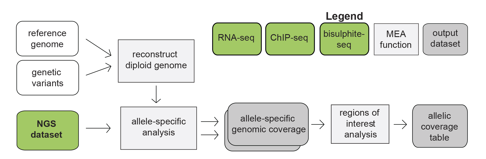

# MEA: a Methylomic and Epigenomic Allele-specific analysis pipeline




Building on our previous work on the ALEA software package, a computational toolbox for allele-specific epigenomics analysis incorporating allelic variation data, we detail here ALEA’s successor - MEA. This package dramatically increases the functionality and usability of ALEA, incorporating allelic variation with existing resources, allowing for the identification of significant associations of epigenetic modifications and specific allelic variants in human and mouse cells. Similar to ALEA, MEA provides a customizable pipeline for allele-specific analysis of next-generation sequencing data which takes raw sequencing data for ChIP-seq, RNA-seq and DNA Methylation analysis, producing a UCSC track hub. MEA takes advantage of the available genomic resources for human (The 1000 Genomes Project Consortium) and mouse (The Mouse Genome Project) to reconstruct diploid in silico genomes for human samples or hybrid mouse samples. Then, for each accompanying ChIP-seq, RNA-seq or DNA Methylation dataset, MEA generates two wig files from short reads aligned differentially to each haplotype. This pipeline has been validated using human and hybrid mouse ChIPseq, RNAseq and DNA Methylation data (See [Test Data](#test-data)). 

## Please refer to the MEA user guide (PDF) for installation and run instructions
  
* [Docker installation](https://github.com/julienrichardalbert/MEA/raw/master/docker)  
* [distribution package](https://github.com/julienrichardalbert/MEA/raw/master/dist/mea.1.0.tar.gz)
* [documentation (PDF)](https://github.com/julienrichardalbert/MEA/raw/master/doc/MEA_UserGuide_v1.0.pdf)
* test data: ftp://ftp.bcgsc.ca/supplementary/ALEA/files/test-data/

## MEApy (in progress on `MEApy` branch)

The branch `MEApy` includes a flat Python interface at repository root:

- `meapy.py`
- `meapy_phase_vcf.py`
- `meapy_create_genome.py`
- `meapy_align_and_track.py`
- `meapy_project.py`

### Install dependencies (one go)

Use Conda/Mamba for MEApy toolchain installation.

```bash
mamba env create -f environment.yml
conda activate meapy
```

If `mamba` is not installed:

```bash
conda env create -f environment.yml
conda activate meapy
```

Current intent:

- simplify pipeline usage with a native Python interface
- combine alignment + track creation into one command (`align`)
- support a Python projection command (`project`) for refmap + wig/bedGraph/bed inputs
- support Python track generation for ChIP/RNA/WGBS
- defer `create_report` migration until core pipeline workflow is stable

Current dependency status:

- `phase-vcf` is native Python and does not use `mea.config`
- `project` is native Python and does not use `mea.config`
- `create-genome` is native Python and does not use `mea.config` (requires `bcftools` and `samtools`)
- `align` supports Python alignment for ChIP/RNA (`bwa`) and WGBS (`bismark`)
- aligner defaults by assay: ChIP `bowtie2`, RNA `STAR`, WGBS `bismark`; `bwa` remains an optional override and RNA can also use `tophat2`

### TopHat2 legacy environment (optional)

TopHat2 is Python-2-era software. On Python 3-only environments it can fail at runtime.
If you want `--aligner tophat2`, create a separate legacy env and prepend its `bin`
directory to `PATH` while running `meapy`:

```bash
mamba create -n tophat2-legacy -c conda-forge -c bioconda python=2.7 tophat bowtie2 samtools -y
LEGACY_BIN="$(conda run -n tophat2-legacy python -c 'import sys, os; print(os.path.dirname(sys.executable))')"
PATH="$LEGACY_BIN:$PATH" python meapy.py align ... --assay rna --aligner tophat2
```

This keeps the main `meapy` environment modern while enabling optional TopHat2 runs.

### Prebuilt index requirement

`meapy.py align` does not build aligner indexes automatically. If an index is missing, it fails fast and prints the exact command to build it.

One-time index build examples:

```bash
# BWA
bwa index /path/to/genome.fa

# Bowtie2
bowtie2-build /path/to/genome.fa /path/to/genome.bowtie2_index

# STAR
STAR --runMode genomeGenerate --genomeDir /path/to/star_index --genomeFastaFiles /path/to/genome.fa --runThreadN 4

# Bismark
bismark_genome_preparation --bowtie2 /path/to/genome_folder
```

Examples:

- `python3 meapy.py phase-vcf --haps-dir <dir> --input-vcf <vcf> --output-prefix <prefix> --compress`
- `python3 meapy.py create-genome --reference-fasta <ref.fa> --phased-vcf <phased.vcf.gz> --strain1 hap1 --strain2 hap2 --output-dir <dir>`
- `python3 meapy.py align --read-layout single --reads1 <reads.fastq.gz> --genome-input <genome.fa> --reference-genome <ref.fa> --strain1 hap1 --strain2 hap2 --bam-prefix <out/prefix> --assay chip --aligner bowtie2 --chrom-sizes <build.chrom.sizes>`
- `python3 meapy.py align --read-layout paired --reads1 <R1.fastq.gz> --reads2 <R2.fastq.gz> --genome-input <genome.fa> --reference-genome <ref.fa> --strain1 hap1 --strain2 hap2 --bam-prefix <out/prefix> --assay wgbs --aligner bismark --chrom-sizes <build.chrom.sizes>`
- `python3 meapy.py align --quick-start --reference-fasta <ref.fa> --read-layout single --reads1 <reads.fastq.gz> --genome-input <create_genome_dir/hap1_hap2.fasta> --strain1 hap1 --strain2 hap2 --bam-prefix <out/prefix> --assay chip`
- `python3 meapy.py project --input <track.bedGraph> --input-format bedgraph --input-refmap <strain.fasta.refmap> --output-bedgraph <projected.bedGraph>`
- `python3 meapy.py doctor --assay all`
- `python3 meapy.py validate --assay chip --bam-prefix <out/prefix> --strain1 hap1 --strain2 hap2 --tracks-output-dir <out>`


## Credits
Hamid Younesy, Torsten Möller, Alireza Heravi-Moussavi, Jeffrey B. Cheng, Joseph F. Costello, Matthew C. Lorincz, Mohammad M. Karimi and Steven J. M. Jones, "ALEA: a toolbox for allele-specific epigenomics analysis." Bioinformatics 30.8 (2014): 1172-1174. [[link to paper](http://bioinformatics.oxfordjournals.org/content/30/8/1172.long)]

Julien Richard Albert, Tasuku Koike, Hamid Younesy, Richard Thompson, Aaron B. Bogutz, Mohammad M. Karimi and Matthew C. Lorincz, "Development and application of an integrated allele-specific pipeline for methylomic and epigenomic analysis (MEA)." BMC Genomics201819:463 (https://doi.org/10.1186/s12864-018-4835-2)


